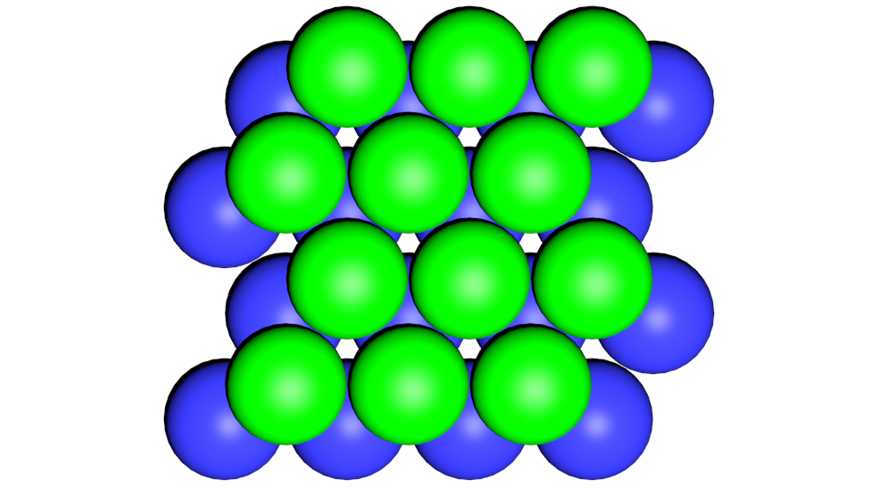

time: 0
class: title, no-number

# Lecture 1 - Ionic structures

.footer[- [Return to course contents](overview.html#overview)
]

---

class: roomy
# Course Summary

This course aims to introduce you to the importance of ionic materials in many applications.

What do I want you to do?
- Revise basic crystallography and ionic solids
- Try to understand examples, **don't memorise them**
- If in doubt - ask questions!

---

class: roomy
# Lecture Notes

- Interactive HTML notes
	- Detailed instructions on overview page
    - Explore the jmol structures!
	- We'll have live quizzes during lectures - please engage
- PDF notes also on Learn if needed

.pull-center[

]

---

# Test poll!

---

# Results

---

time: 12
class: roomy
# Lecture 1 Summary
$\require{mediawiki-texvc}$

- Types and applications of ionic materials
- Crystallography recap
- Lattice energy and ionic bonding 
- Close-packing and ionic structure types

---

time: 42
# Introduction

'Ionic materials' consist of both cations and anions:

- Many inorganic solids
	- e.g. $\ce{Na+Cl-}$ and $\ce{Mg^2+SO_4^2-}$
--

- Organic salts
	- ammonium acetate $\ce{NH4+CH3COO-}$
	- [chlorphenirammonium maleate](https://www.nhs.uk/medicines/chlorphenamine-including-piriton/)  (active part of Piriton&reg;)
	
--
	
- (in)organic salts
	- Mono-/Di-/Tri-Sodium citrate  $\ce{Na\_{x}C6H\_{8-x}O7}$ 
		- collectively used as E331 in food
		- $\ce{x}$ can be varied from 1&ndash;3
	
--
	
- Ionic liquids
	- Either organic or inorganic, liquid below 100 &deg;C

---

class: compact
time: 215
# Why are they interesting?

- Large range of practical applications
	- important for energy storage, but lots of other applications!
	- ionic liquids are gaining attention for many applications
--

- High melting points due to Coloumbic energy (see [later](#ionic_bonding))
--

- Electrically insulating
	
	- Electronegativity differences promote localised electrons

--

- Usually hard, and often robust to harsh conditions
	- e.g. Synroc is used to encapsulate nuclear waste

???

Ionic solids find applications in a huge number of places, including:
- Batteries
- Dielectrics / ferroics (e.g. piezoelectrics)
- Fuel cells
- Laser materials; $\ce{Cr-Al2O3}$
- Magnetic materials; $\ce{\gamma-Fe2O3}$ (for information storage), $\ce{YBa2Cu7O_{7-x}}$ (high-T superconductor)
- Catalysts; $\ce{Bi2MoO6}$
- Phosphors

Synroc is a mixture of titanium oxide minerals

---

time: 5:33
class: compact

# We can divide solids into two categories:

.pull-left[
**Molecular** (e.g. paracetamol)
- Strong intramolecular bonds
- Weaker intermolecular interactions

]

.pull-right[
**Infinite** (e.g. NaCl)
- Strong bonds between all atoms
- No discrete molecules

]

.clear-both[
 
We'll concentrate on **infinite materials**.
]

???
Infinite materials are probably the most widely studied in terms of a broad range of ionic properties,
but it is important to realise that there are a number of important appplications (and research into)
molecular ionic materials, including:

- polymeric ionic conductors (for fuel cells)
- Molecular salts for phamaceutical applications
	- Often better *in-vivo* properties than e.g. co-crystals
- Ionic liquids for e.g. nuclear waste processing

---

time: 7:00
# Recap on crystal structure

Periodic solids can be described by a unit cell

- Defined by lengths ($a$, $b$, $c$) and angles ($\alpha$, $\beta$, $\gamma$)
	- 'Lattice parameters'
--

- Possesses 'space group' symmetry (an extension to point groups)
--

- Atom positions defined by fractional position along lattice directions

???

## Space group symmetry
Space group symmetry extends the idea of point groups to include translational symmetry (adding 'glide planes' and 'screw axes'
to the more familiar symmetry elements such as mirror planes and rotations). The combination of **all** possible symmetry combinations
generates a finite number (230) of space groups.

---

time: 9:02
class: compact
# Example: Sodium chloride

.pull-center[

]

 | |
----------------|---|--
Cubic structure | $a = b = c = 5.62\ \AA{}$, $\alpha = \beta = \gamma = 90^\circ$  |
Spacegroup      | $\mathrm{Fm\bar3 m}$ (#225, point group = $\mathrm{O_h}$) |
Na atoms at:    | (0 0 0)       &ensp; (&half; &half; 0) &ensp;  (&half; 0 &half;) &ensp;  (0 &half; &half;) | (all symmetry-related)
Cl atoms at:    | (&half; 0 0)  &ensp; (0 &half; 0)      &ensp;  (0 0 &half;)      &ensp;  (&half; &half; &half;) | (all symmetry-related)

Because of symmetry, we only need to define one Na and one Cl position.
---

name: ionic_bonding
time: 10:49
# Ionic Bonding

- Ionic compounds stay together because of electrostatic interactions (strong)
--

- Total electrostatic energy is the (infinite) sum over *all* ion pairs,
$$ E\_{\mathrm{Madelung}} = \sum_{i \neq j} \frac{q_i q_j}{4\pi \epsilon_0 r} $$
	$q$ is the charge on ions $i$, $j$ and $r$ is the distance between them
--

- $\frac{1}{r}$ dependence makes long-range interactions important

.footer[
- see Chemistry 1 "States of Matter" for a recap on ionic compounds]

	
???
- One assumption here is that the ions act as hard spheres with integral charges; less valid for highly polarisable ions
- $\epsilon_0$ is the permittivity of free space

	
---

class: compact
time: 13:26
# Infinite summations

- For infinite solids, periodicity usually means the sum converges
	- As $r$ increases, the contribution becomes smaller.
--

- An infinite sum can therefore be replaced by the Madelung constant
	- depends on the structure type
--

.pull-left[
For example $\ce{NaCl}$:
]
.pull-right[
![:jmol 350, 150, 2, 2, 2, unitcell off; axes off;
while (TRUE) \(
hide all;
display (all)\<79\>;
select (all)\<79\>;
delay 3;
color atoms translucent;
display add WITHIN(3.5\~ (all)\<79\>);
select WITHIN(3.5\~ (all)\<79\>);
delay 3;
color atoms translucent;
display add WITHIN(4\~ (all)\<79\>);
select WITHIN(4\~ (all)\<79\>);
delay 3;
color atoms translucent;
display add WITHIN(5\~ (all)\<79\>);
select WITHIN(5\~ (all)\<79\>);
delay 3;
color atoms translucent;
display add WITHIN(6\~ (all)\<79\>);
delay 3;
select all;
color opaque;
\);
](files/NaCl.cif)
]

$$
\begin{align}
E\_{\mathrm{Madelung}} &= \sum_{i \neq j} \frac{q_i q_j}{4\pi \epsilon_0 r} \\\\
&= \frac{\mathrm{N_A} q_i q_j}{4\pi \epsilon_0 r} \left( 6 - \frac{12}{\sqrt{2}} + \frac{8}{\sqrt{3}} - \frac{6}{2} + \frac{24}{\sqrt{5}} - ... \right) \\\\
&\simeq \frac{\mathrm{N_A} q_i q_j}{4\pi \epsilon_0 r} \times 1.74756
\end{align}
$$

???
- Whilst the infinite sum converges for some structures, for others it actually diverges (as the number of neighbours at distance $r \propto 4 \pi r^2$).
- Note that for $\ce{NaCl}$ the series shown (based on expanding $r$ as a sphere) has actually been proved to diverge, but I include it as it is conceptually easier to understand!
The correct value is obtained by expanding the cubic unit cell as a cube (rather than a sphere); this series does converge, but is more complex!

In reality, a number of methods exist to perform the summation, in particular the [Ewald Method](https://en.wikipedia.org/wiki/Ewald_summation) (commonly used in atomistic simulations) 

---

time: 16:26
# Ionic Structures

Generally, structures **maximise cation-anion** interactions (-ve energy) while **minimising like-charge** interactions (+ve energy)
- Maximise cation-anion coordination number
	- Ideally, ions should be densely packed
	

In many materials, the optimum is found when the largest ion (often oxide) is **close-packed**

???
Although short-range electrostatics are important, the importance of long-range electrostatic interactions cannot
be ignored. Often, it is not possible to predict which structure will occur based just on local coordination number arguments

---

time: 18:53
# Close packing

---

time: 20:34
# Close packing

.pull-left[
Face-centered cubic (FCC) 
... .blue[A].green[B].gold[C].blue[A].green[B].gold[C] ...
<video width="350" height="350" controls loop autoplay muted>
    <source src="./images/fcc_animated.mp4" type="video/mp4">
</video>
]

.pull-right[
Hexagonal close-packed (HCP)  
... .blue[A].green[B].blue[A].green[B].blue[A].green[B] ...
<video width="350" height="350" controls loop autoplay muted>
    <source src="./images/hcp_animated.mp4" type="video/mp4">
</video>
]

---

time: 21:38
# Holes

CP arrangements of large (an)ions [X] leave 'holes' within the structure, which can be occupied by smaller (cat)ions [M]

---

# How are you getting on? Vote

---

# How are you getting on? Results

---

time: 22:53
# Octahedral holes

One .gold[hole] per .red[cp ion] - both are 6-coordinate

.pull-left[

Rock salt (NaCl) structure
]

.pull-right[

Nickel Arsenide structure (e.g. FeS)

]

---

time: 24:14
# Rutile

Although not strictly close-packed, rutile (.gold[Ti].red[O2]) is distorted HCP
with $\ce{Ti^{4+}}$ filling half the octahedral holes
CN = .gold[6] / .red[3]

.pull-center[

]

---

time: 25:58
class: compact
# Tetrahedral holes

Two .gold[holes] per .red[cp ion]

.pull-left[

]

.pull-right[

]

 

Holes filled | FCC Type | CN(.gold[A]/.red[X]) |  | HCP Type | CN(.gold[A]/.red[X])
-------------|------|-------------|------------|---|----
All | Fluorite (.red[Ca].gold[F2]) | .gold[4]/.red[8] |  | (not possible) | -
Half | Zinc-blende (.gold[Zn].red[S]) | .gold[4]/.red[4] | &emsp; | Wurtzite (.gold[Zn].red[S]) | .gold[4]/.red[4]

---

class: compact
time: 28:07
# Which structure type?

Generally, the structure formed depends on the ratio of ionic radii
- Smaller cations will prefer lower coordination numbers
	
$\frac{r^{+}}{r^{-}}$  |  Cation C.N.  | MX Structure | MX2 Structure 
-----------------------|---------------|--------------|---------------------------
0.7 - 1.0              | 8             | $\ce{CsCl}$         | $\ce{CaF2}$
0.4 - 0.7              | 6             | $\ce{NaCl}$         | $\ce{TiO2}$
0.2 - 0.4              | 4             | $\ce{ZnS}$ (Wurtzite/Zinc-blende) | Anti-fluorite (e.g. $\ce{Li2S}$)

These are only approximate 'rules', and other binary structures exist (e.g. $\ce{CdI2}$, $\ce{CdCl2}$, $\ce{PbO}$, etc...)
- Very difficult to predict!

---

class: compact
time: 31:37
# Beyond binary compounds

With 3 or more elements, structures become much more complicated!

An important one is perovskite, $\ce{ABX3}$
- $r(\mathrm{A}) \simeq r(\mathrm{X})$, so can be considered as FCC $\ce{AX3}$ layer with $\ce{B}$ filling 25% of octahedral holes:

.pull-left[]

.pull-right[

]

---

time: 33:56
# Lecture recap

- Variety of ionic materials with a range of applications
- Revision of basic crystallography
	- Unit cells, symmetry
- Electrostatic interaction hold ionic crystals together
	- Long-ranged
	- Aim to maximise cation-anion interactions
- Close-packing of anions often most stable
	- Ratio of ionic radii suggests which structure is adopted
	- Beyond binary compounds, predicting structures is hard!

---

# Feedback

.footer[- [Return to course contents](overview.html#overview)
]

