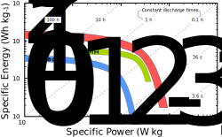
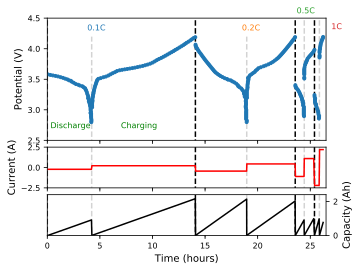
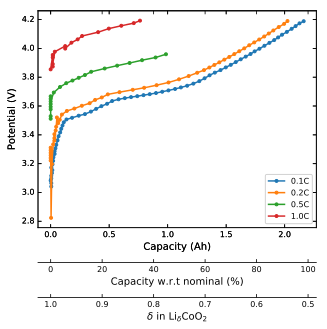

class: title

# Ionic Materials

### Dr James Cumby
### james.cumby@ed.ac.uk

.footer[
- Room 269
- Try pressing 'h' for help!
]

---

# Lecture Overview

Lecture | Topic
--|-------------
1 | Introduction to ionic materials
2-3 | Batteries
4 | (Super) capacitors
5 | Fuel Cells 

## Recommended Reading

Basic Solid State Chemistry, A. R. West, _Wiley_, **1988** and references given during course.

---
class: compact

# Introduction

'Ionic materials' consist of both cations and anions:

- Many inorganic solids
	- e.g. $\ce{Na+Cl-}$ and $\ce{Mg^2+SO_4^2-}$
--

- Organic salts
	- ammonium acetate $\ce{NH4+CH3COO-}$
	- [chlorphenirammonium maleate](https://www.nhs.uk/medicines/chlorphenamine-including-piriton/) (active part of Piriton&reg;)
	
--
	
- (in)organic salts
	- Mono-/Di-/Tri-Sodium citrate $\ce{Na\_{x}C6H\_{8-x}O7}$ 
		- collectively used as E331 in food
		- $\ce{x}$ can be varied from 1&ndash;3
	
--
	
- Ionic liquids
	- Either organic or inorganic, these are liquid below 100 &deg;C

---
class: compact

# Why are they interesting?

- Large range of practical applications
	- important for energy storage, but lots of other applications!
	- ionic liquids are gaining attention for many applications
--

- High melting points due to Coloumbic energy
--

- Electrically insulating
	- Electronegativity differences promote localised electrons
	
--

- Usually hard, and often robust to harsh conditions
	- e.g. Synroc is used to encapsulate nuclear waste

???

Ionic solids find applications in a huge number of places, including:
- Batteries
- Dielectrics / ferroics (e.g. piezoelectrics)
- Fuel cells
- Laser materials; $\ce{Cr-Al2O3}$
- Magnetic materials; $\ce{\gamma-Fe2O3}$ (for information storage), $\ce{YBa2Cu7O_{7-x}}$ (high-T superconductor)
- Catalysts; $\ce{Bi2MoO6}$
- Phosphors

Synroc is a mixture of titanium oxide minerals

---
class: compact

# We can divide solids into two categories:

.pull-left[
Molecular (e.g. paracetamol)
- Strong bonds within molecules
- Weaker intermolecular interactions

]

.pull-right[
Infinite (e.g. NaCl)
- Strong bonds between all atoms
- No discrete molecules

]

--

We'll concentrate on **infinite materials**.

---
class: compact

# Recap on crystal structure

Infinite solids can be described by a unit cell
- Defined by lengths ($a$, $b$, $c$) and angles ($\alpha$, $\beta$, $\gamma$)
	- 'Lattice parameters'
- Possesses 'space group' symmetry (extension to point groups)
- Atom positions defined by fractional position along lattice directions

???

## Space group symmetry
Space group symmetry extends the idea of point groups to include translational symmetry (adding 'glide planes' and 'screw axes'
to the more familiar symmetry elements such as mirror planes and rotations). The combination of **all** possible symmetry combinations
generates a finite number (230) of space groups.

---
class: compact

# Example: Sodium chloride

 | |
----------------|---|--
Cubic structure | $a = b = c = 5.62 \AA{}$, $\alpha = \beta = \gamma = 90^\circ$  |
Spacegroup      | $\mathrm{Fm\bar3 m}$ (#225) |
Na atoms at:    | (0 0 0)       &emsp; (&half; &half; 0) &emsp;  (&half; 0 &half;) &emsp;  (0 &half; &half;) | (symmetry-related)
Cl atoms at:    | (&half; 0 0)  &emsp; (0 &half; 0)      &emsp;  (0 0 &half;)      &emsp;  (&half; &half; &half;) | (symmetry-related)

---

# Ionic Bonding

Electrostatic interactions are between pairs of atoms
- Lowest energy by maximising strong cation-anion interactions
- Achieved by maximising cation-anion C.N.
	- (as long as 

---

# Energy sources

To meet this demand will require a combination of energy sources:

.pull-left.w20[
- Fossil Fuels
	- Coal
	- Oil
	- Gas
- Nuclear
- Renewable 
    - Wind 
    - Solar 
    - Hydro
- ... 
]

--

.pull-right.w80[  ]

.footnote[&copy; Lynn Orr]

---

# **All** sources have problems...

.pull-left[
### Fossil fuels

- **Finite supply**
- Environmental cost (i.e. climate change)
- Political uncertainty
]
.pull-right[

]
--
.pull-left[
### Nuclear
- "Finite" supply
- Concerns over waste storage
- Political issues
]

.pull-right[

]

--
.pull-left[
### Renewable
- Intermittent source
- (Relatively) expensive (although this is changing)
- Limited lifespan of components
]

.pull-right[

]
---

background-image: url(./images/renewable_energy_bulb.jpg)

# Drivers behind change

- Problems with energy supply/demand
- Climate change
    - CO2 emissions
- Other emissions
    - NOx
    - SOx
    - Particulates
    - Others
- Dwindling oil and gas resources
- Poltical aspects of fuel supply

---

# Energy storage

If we aim to increase renewable sources, we need a way to *store* this energy.

- Supply cannot immediately respond to changes in demand
- Inefficient to waste "excess" energy (e.g. on a windy day)

### How can we store this energy?

--

Historic approaches:

Technology                                   | Energy   | conversion
---------------------------------------------|-----------------: | --------
- Burning wood								 | Chemical potential |&rarr; Heat
- Firebrick   &nbsp&nbsp(Used since the Hittites)	 | Heat |&rarr; Heat
- Gravity!									 | Gravitational potential |&rarr; Kinetic
&nbsp&nbsp *e.g.* Irrigation (Hanging Gardens of Babylon)| 
&nbsp&nbsp *e.g.* Mill ponds (modifying existing rivers) |
	
---

# Energy storage history

The discovery of electricity introduced much more variety into energy storage methods:

.highlighttable[
Technology        | Energy   | conversion
---------------------------------------------|------------------: | ---------
- Burning wood								 | Chemical potential |&rarr; Heat
- Firebrick   &nbsp&nbsp(Used since the Hittites) | Heat | &rarr; Heat
Gravity!	| Gravitational potential | &rarr; Kinetic |
&nbsp&nbsp *e.g.* Irrigation, Mill ponds |
 | |
- Batteries                                  |           Chemical   | &rarr; Electrical
- (Super-) Capacitors           | Electrical | &rarr; Electrical
- Fuel Cells                                |           Chemical   | &rarr; Electrical
  |  | 
- Cryogenic / Liquid air       | Kinetic (from electrical) | &rarr; 'Heat'
- Mechanical (*e.g.* flywheels)  | Kinetic      | &rarr; potential
]

---

# Efficient energy storage relies on *materials*
### Important properties for energy storage:

- **Cost**
- (Long-term) stability; reactivity
- Durability
- Compatibility of different materials
- Material performance
	- Ionic conduction
	- Electronic conduction

---
class: center, middle
# Batteries

---
class: centre, top, compact
# Battery History

.pull-left.w75[ ***ca.* 190 AD**: Baghdad (or Parthian) battery
- Iron and copper electrodes, filled with vinegar or wine
- Possible uses: medicinal, religious or electro-plating!
]
.pull-right.w25[ ]
.footnote[&copy; GuidoB]
--
.pull-left.w75[**1800**: Volta created the voltaic pile
- Alternating Ag and Zn discs, NaCl electrolyte
- Enabled *chemistry* e.g. 2H2O &rarr; H2 + O2
- Corrosion limited battery life
]
.pull-right.w25[]
--
.pull-left.w75[
**1836**: Daniell cell: .grey[Zn|Zn2+,SO42- || SO42- | Cu2+ | Cu ]
- First practical electricity source (used to power telegraphs)

**1859** Lead-acid battery (first rechargeable)
]
.pull-right.clear-right.w25[]
--
.pull-left.clear-left.w75[
**1886** The first dry cell, .grey[Zn | NH4Cl | MnO2 ]
- NH4Cl immobilised with plaster of Paris (CaSO4&middot;0.5 H2O)

**1899** The first alkaline battery .grey[NiO(OH) | KOH | Cd]
- Higher energy density than lead-acid, but expensive
]
--
.pull-left.clear-left.w75[
**1991** Li-ion battery commercialised by Sony
]

???

Voltaic pile came about as a disagreement between Volta and Galvani; the latter
had discovered that frogs legs would move when forming a circuit from two different types of metal.
Galvani asserted this was 'animal electricity'

---
exclude: false
background-image: url(./images/nobel_prize_2019.jpg)

--

.pull-left.w30[Akira Yoshino]
.pull-center.w33[John B. Goodenough]
.pull-right.w30[M. Stanley Whittingham]

.pull_center.v400px.h150px[]

.footnote[https://www.nobelprize.org/prizes/chemistry/2019/popular-information/]

---
exclude: false
class: blackbkg

<iframe width="750" height="600" src="https://www.youtube-nocookie.com/embed/CkIKRoTFogU" frameborder="0" allow="accelerometer; autoplay; encrypted-media; gyroscope; picture-in-picture" allowfullscreen></iframe>

---

# Battery Operation

.pull-left[  ]
.pull-right[  ]

 
**NOTE**: In rechargeable cells, naming of *anode* and *cathode* is often unclear. Here we define:
- Cathode is **positive** electrode under **discharge**
- Anode is **negative** electrode under **discharge**

---
# Improving batteries

The most important parameter in improving batteries is the total *energy capacity*, `\(E\)`
- Combination of cell voltage (*V*) and amount of charge (*Q*) stored in material:
.red[$$
E_{\mathrm{bat}} = QV
$$]
.grey[*Q* is expressed in units of Ah (1 mAh = 3.6 C), so *E*bat is in Wh (Watt-hours)]

--

- *E*bat is dependent on the amount of battery material. More useful are:
	- Specific (gravimetric) energy (Wh g-1). .grey[ Q is charge per unit mass (Ah g-1)]
	- (Volumetric) energy density (Wh L-1). .grey[ Q is charge per unit volume (Ah L-1)]

.pull-left.w30[   .center[We want to maximise volumetric and gravimetric energy densities]]
	
.pull-right.w60[]
	

.footnote[&copy; Barrie Lawson]

???

Energy capacity is often also known as 'nominal energy' or just 'energy'. It is simply the amount of useful energy stored in the battery.

Note that 1 Wh = 3600 J!

---
# Increase *E*bat: Increase *voltage* `\(V\)`

---
class: fit-h1,

# Increase *E*bat: Increase *charge* `\(Q\)`

Faraday's Law:
$$
Q_{\mathrm{theoretical}} = \frac{nF}{3.6 M_w}\qquad(\text{in mAh g}^{-1})
$$

--

*e.g.* for `\( \ce{LiCoO_2 -> Li^+ + e^- + CoO_2}\)` :
.pull-right.w20[]

--

.clear_left[
$$
n = 1,
F = 96485.3 \: \mathrm{As\:mol}^{-1} \\\\
M_w = 97.873\: \mathrm{g\: mol^{-1}} \\\\
\therefore Q = 274\: \mathrm{mAh\: g}^{-1} \\\\
$$
]

--

In reality, the charge stored is less than the theoretical maximum

- For LiCoO2, CoO2 is *very* unstable: `\( \ce{2Co^{IV}O_2 -> Co^{III}_2O_3 + \frac{1}{2}O_2} \)`
	- We can only safely reach Li0.5CoO2, so the useful capacity is 137 mAh g-1

???
	
Effectively, this is charge stored (nF) per formula mass. The factor 3.6 converts F from A.s mol^{-1}) into A.h mol^{-1}
	
---
# Charging rates

Ideally we want to charge batteries quickly

Define charge rate, `\( C = \frac{I}{Q} \)`, the ratio of discharge current to capacity
- *i.e.* for a 1000 mAh (1 Ah) battery:
	- `\(1C\)` => current of 1 A, which could be sustained for 1 hour
	- `\(2C\)` => 2 A (for 30 mins)
	- `\(\frac{C}{6} \)` => 0.167 A (for 6 hours) 
- This allows us to describe charging rates independent of battery capacity.

---
# Effect of rate on capacity

High charging rates reduce capacity

- Electrons can move much faster than ions, so at high *C*-rates strain occurs in the lattice
	- Ions get stuck, reducing the overall discharge capacity
	- Irreversible damage to crystal structure and/or microstructure can occur, preventing future charging

  
	
	
.footnote[B. Song, *J. Mat. Chem. A*, **2015**, 18171.]
	
???

Peukert's law was empirically derived to explain the variation in capacity with C for lead-acid batteries (which are sold 
with a capacity under a specified discharge rate:

$$
t = H \left( \frac{Q}{IH} \right)^{k}
$$

where t is the actual discharge time, H is the rated discharge time (in hours), Q is the capacity (in Ah)
and I is the discharge current. k is the Peukert constant, and typically falls in the range 1.1-1.3. 

For an ideal battery (with no change in capacity for any cycling rate) k = 1. In reality, k increases
with battery cycling nad/or age.

**NOTE:** Peukert's law was developed for lead-acid batteries, and doesn't apply well to e.g. Li-ion. This
is because it takes no account of temperature (from Nernst equation V&uarr; as T&uarr;) which is particularly
important in Li-ion batteries.

---
#Ragone .grey[(*ru-GO-nee*)] plot

Displays the relation between *specific energy* (`\(E\)`) and *specific power* (`\(P\)`):

.pull-left.w30[`\\(E = QV (=ItV)\\)`] .pull-right.w70[The total amount of energy available in the battery]
   
.pull-left.clear-both.w30[`\\( P = IV \\)`] .pull-right.w70[The rate at which energy can be used]

.clear-both[ Some applications require fast discharge over short times (e.g. electric sports car accelerating) while others need 
more sustained energy supply (long-range electric vehicle)]

.footnote[B.D. McCloskey, J. Phys. Chem. Lett., **2015**, 6, 3592-3593.]

---
# Electrochemical measurements

Typically we use *Galvanostatic* (constant current) measurements to characterise battery response, and measure the resulting
voltage.
- Charging rates have a big impact on device performance, so *potentiostatic* (*i.e.* constant voltage) measurements 
would be difficult to attribute to chemistry *vs.* rate effects.

.pull-left.w60[]
.pull-right.w30[]
.pull-right.w30[]

---
# Electrochemical measurements

*e.g.* for a 2.2 Ah battery:

.pull-left.w60[]

--

.pull-right.w40[]

.pull-left.w80[  Capacity can be expressed in a number of formats]

---
# What can we learn from galvanostats?

 change between &alpha; and &beta; due to a more-stable &gamma; phase with narrow composition window.]] &
]
)

???

To a first approximation, the voltage depends linearly on the curvature of free energy with x,
$$
V \propto -\frac{\partial G(x)}{\partial x}.
$$
In the case of phase mixtures, the free energy follows a linear combination of the two phase minima,
 so the potential is constant.

For more information, see http://cpb.iphy.ac.cn/article/2016/1806/cpb_25_1_018210.html#close

---
#Example: Na*x*CoO2

.footnote[Berthelot *et al*, *Nature Materials*, **2010**, 74-80.]

---
# Key materials properties

.pull-left.w33[
**Anode**
- Good electronic conductor
- Good ionic conductor
- Structural stability on ionic movement
]
.pull-left.w33[
**Electrolyte**
- Good ionic conductor
- *Negligible* electronic conduction

]
.pull-right.w33[
**Cathode**
- Good electronic conductor
- Good ionic conductor
- Structural stability on ionic movement
]

.clear-both[
.pull-center[**Overall**]

- Compatibility between materials (particularly under volume changes during charge/discharge)
]
.pull-left[ ]
.pull-right[ ]

