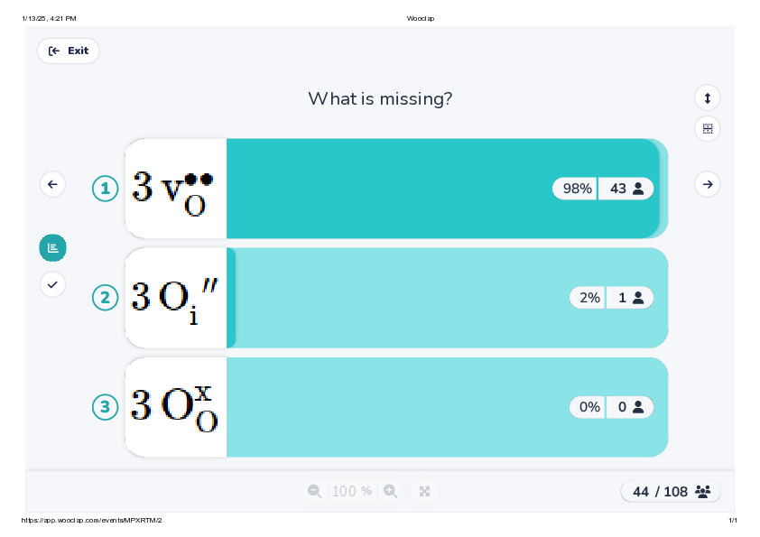
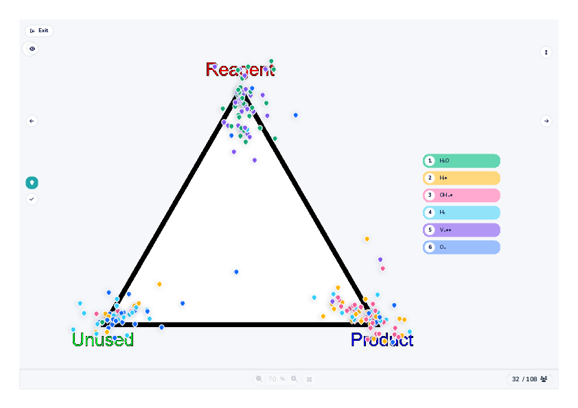

class: title, no-number
time: 0
# Lecture 2 - defects

.footer[- [Return to course contents](overview.html#overview)
]

---

class: roomy

# Lecture summary
$\require{mediawiki-texvc}$

- Introduction to defects
- Types of defect
- Instrinsic and extrinsic defects
- Defect equations

.footer[- See Chapter 2 of [Solid State Materials Chemistry](https://doi.org/10.1017/9781139025348), Woodward 2021.
]

---

class: compact, no-number
# Defects

**All** crystals contain defects of some sort, for example:
- Missing atoms (*vacancies*)
- Atoms in the 'wrong' place
	- *interstitials* (between lattice sites) or *substitutions* (different atom types)
- Extended defects of lines or planes of atoms

--

Defects are often the source of interesting properties

.footer[
- ~1% Substitution in $\ce{Al2O3}$
- Effect of interstitial carbon on iron properties
]

---

class: compact
# Defect amounts

The number of defects is a fine balance of entropy and enthalpy
- Defects gain entropy but have a (often large) formation energy

Minimum in $\mathrm{\Delta G}$ depends on structure and bonding, but typically << 1%.

---

class: compact
# Types of defect

The three most common defect types in ionic solids are:

Vacancy | Interstitial | Substitution |
:-----|:----:|----:
 |  | 

--

Additionally, defects can be either 
- *intrinsic* (maintaining stoichiometry) or 
- *extrinsic* (non-stoichiometric)

---

class: no-number
# Intrinsic defects

Two of the most common stoichiometric defects are:

**Schottky**
- Charge-balanced combination of anion and cation vacancies

**Frenkel**

- Ions displaced to interstitial sites

Defects observed depend on both structure type and atoms involved.

.footer[
- Top: [Walter Schottky (1886-1976)](https://physicstoday.scitation.org/doi/pdf/10.1063/1.3023533)
- Bottom: [Yakov Frenkel (1894-1952)](https://olemiss.edu/sciencenet/poronet/frenkel-bio.pdf)
]
---

# Schottky defects

- Typically occur when anions and cations have similar size (e.g. $\ce{NaCl}$ structure)
- Reduced density compared with the ideal material
- e.g. $\ce{NaCl}$ - equal numbers of $\ce{Na}$ and $\ce{Cl}$ vacancies

.pull-left[]

.pull-right[

]

???

Careful density measurements can be useful for determining Schottky defect concentrations around 1%, but difficult for smaller concentrations.

---

# Frenkel defects

- Smaller ion normally displaced
- Only one ion type shows defect
- e.g. $\ce{AgCl}$ ($\ce{NaCl}$-type)
	- Smaller $\ce{Ag+}$ ion displaced to tetrahedral holes in CCP $\ce{Cl-}$ structure

.pull-left[]

.pull-right[

]

---

# Defect equations

Useful to write equation for defects, using **Kroger-Vink** notation:
- Normal chemical symbols used for atoms, and $\ce{V}$ for vacancies
--

- Subscripts denote lattice or interstitial ($\ce{i}$) sites
--

- Charges shown relative to the ideal host site:
	- $\ce{'}$ for $1-$, $\ce{''}$ for $2-$, etc.;
	- $\ce{\bullet}$ for $1+$, $\ce{\bullet\bullet}$ for $2+$, etc.;
	- $\mathrm{x}$ for no net charge (sometimes omitted)
--

- For example:
	- Na vacancy in NaCl: $\ce{V_{Na}{'}}$
	- Ag interstital in AgCl: $\ce{Ag_{i}^{\bullet}}$

---

class: roomy
# Defect equations (2)

like normal, defect equations must balance in terms of:
- composition
	- vacancies are not treated as an atom
- charges
- **sites**
	- *specified* atomic positions cannot be created or destroyed
	- interstitials are ignored in balancing

---

# Examples

$\ce{AgCl}$ interstitial formation again:

$$ \ce{Ag\_{Ag} <=> Ag\_{i}^{\bullet} + V\_{Ag}{'} } $$

--

$\ce{NaCl}$ Schottky formation:

$$ \ce{Na\_{Na} + Cl\_{Cl} <=> V\_{Na}{'} + V\_{Cl}^{\bullet} + NaCl } $$

--

Easily extended to substitutions, e.g. substituting $\ce{Al^{3+}}$ with $\ce{Cr^{3+}}$ in $\ce{Al2O3}$ (ruby):

$$ \ce{ 2Al\_{Al} + Cr2O3 <=> 2 Cr\_{Al} + Al2O3 } $$

???

Another way to think about $\ce{NaCl}$ Schottky formation is displacing one $\ce{Na+}$ and one $\ce{Cl-}$ to a 'new' unit cell on the 
edge of the crystal.

Writing an iso-electronic subsitution with Kroger-Vink notation is somewhat unnecessary, but will hopefully serve as an introduction to substitution!

---

class: compact
# Quick test - $\ce{BaTiO3}$ Schottky Formation

$$
\ce{Ba\_{Ba} + Ti\_{Ti} + 3O\_{O} <=> V\_{Ba}{''} + V\_{Ti}{''''} +\ ?? + BaTiO3}
$$

.footer.center[Wooclap Code: MPXRTM]

---

$$
\ce{Ba\_{Ba} + Ti\_{Ti} + 3O\_{O} <=> V\_{Ba}{''} + V\_{Ti}{''''} +\ ?? + BaTiO3}
$$

---

class: roomy
# Ionic Substitution

- Ions of similar size can often replace each other
--

- While an integer number are substituted across a crystal, the average can be non-stoichiometric
	- often represented by a variable such as $\ce{x}$:
	- i.e. Ruby is $\mathrm{Al}\_{2-x}\mathrm{Cr}\_{x}\mathrm{O}\_3\quad(0 \leq x \leq 2)$ 
--

- Substitution can dramatically affect properties:
	- e.g. $\mathrm{La}\_{2-x}\mathrm{Sr}_{x}\mathrm{CuO\_4}$:
		- semiconducting for $x = 0$
		- superconducting (below 40 K) for $x = 0.15$
	
???

Measuring the size of an atom is difficult, but here I'll refer to the ionic radius.

---

# Extrinsic defects

Substitution can also drive formation of defects,
e.g. doping $\ce{NaCl}$ with $\ce{CaCl2}$:

Overall synthesis reaction:
$$ (1-2x)\mathrm{NaCl} + x\mathrm{CaCl}\_2 \rightarrow \mathrm{Na}\_{1-2x}\mathrm{Ca}\_{x}\mathrm{Cl} $$

--

Kroger-Vink notation:
$$ \ce{2 Na\_{Na} + CaCl2 <=> Ca\_{Na}^{\bullet} + V\_{Na}{'} + 2NaCl} $$

---

# More complex example

Sometimes, substitution (or 'doping') can give rise to multiple potential defects.

For example, replacing $\ce{La^{3+}}$ by $\ce{Sr^{2+}}$ in $\ce{LaCoO3}$ could occur:

--

- by creating oxygen vacancies;
$$ \ce{ 2La\_{La} + 2SrO + O\_{O} <=> 2Sr\_{La}{'} + V\_{O}^{\bullet\bullet} + La2O3 } $$

--

- or by oxidising $\ce{Co^{3+}}$ to $\ce{Co^{4+}}$
$$ \ce{ 2La\_{La} + 2SrO + \frac{1}{2} O2 + 2Co\_{Co} <=> 2Sr\_{La}{'} + 2Co\_{Co}^{\bullet} + La2O3 } $$

???

It is impossible to determine which defects form just from looking at the formula; it is necessary to measure them (e.g. determine the Co oxidation state); this is not always easy,
particularly for small numbers of defects!

---

class: compact
# Quiz 2 - UO2 Extrinsic defects

Nuclear fuel (fluorite-type $\mathrm{UO\_{2}}$)  can oxidise in air to form $\mathrm{UO}_{2+\delta}$.

---

# Results - UO2 defects

---

class: compact
# Quiz 3 - More Extrinsic defects

At high pressure, oxygen vacancies in $\ce{Mg2SiO4}$ can react with $\ce{H2O}$ to form new defects.

---

# Results - Extrinsic defects

---

class: compact
# Solid solutions

Frequently, substitutional defect concentrations can exceed 1%
- known as a 'solid solution'
- Very important for tuning properties *via* synthesis
- Often useful to think of the "average ion" properties at each site
	- e.g. ionic radius, resulting in *Vegard's Law*
		- Lattice parameter is weighted average of the end-members, e.g. $\ce{Al\_{2-x}Cr\_{x}O3}$:

.pull-left[	

]
.pull-right[

]

???

The terms solid solution and doping are used interchangeably, but often depend on the specific research area.

Note in many areas (e.g. phosphor materials) small amounts of doping is denoted by a colon, e.g. $\ce{ScVO4:Bi}$ 
represents the same as $\ce{Sc\_{1-x}Bi\_{x}VO4}$.

---

# Non-stoichiometry

Some materials are naturally non-stoichiometric even without extrinsic defects

- Very common in transition metal compounds
	- multiple oxidation states available
- Example: $\ce{FeO}$ (wustite, $\ce{NaCl}$ structure) cannot actually form stoichiometrically at ambient pressure
	- Actually $\ce{Fe\_{1-x}O}$, with $0.05 \leq x \leq 0.15$
	
--

**Note: From cation:anion ratio alone you cannot determine the defect type(s)**  
e.g. Fe:O ratio of 0.9 could equally be $\mathrm{Fe\_{0.9}O}$ or $\mathrm{FeO\_{1.11}}$!

???

The exact composition formed is dependent on the synthesis conditions, in particular temperature (as higher temperature 
would cause the entropy term to dominate, assuming the product could be 'quenched' to room temperature).

---

# Lecture recap

- Crystals are never perfect!
	- defects favoured at higher temperature
- Three main types of defect:
	- vacancy (called Schottky if stoichiometry maintained)
	- interstitial (called Frenkel if stoichiometry maintained)
	- substitution or extrinsic
- Kroger-Vink notation is a way to write defect equations
- Some materials can form solid solutions and/or non-stoichiometric compositions
- If defects order, this can lead to new stoichiometric structure types

---

# Feedback

.footer[- [Return to course contents](overview.html#overview)
]
