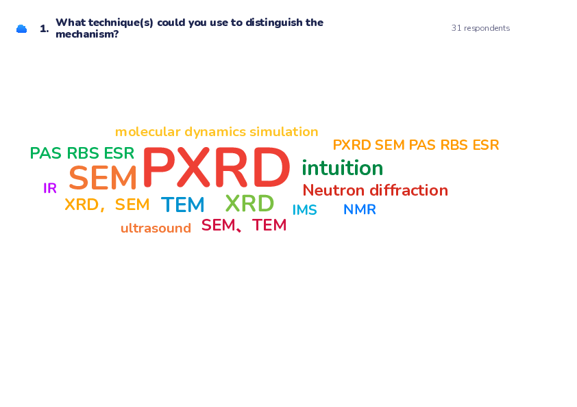

class: title, no-number
time: 0
# Lecture 3 - Ionic Conductivity

.footer[- [Return to course contents](overview.html#overview)
]

---

class: roomy
# Lecture summary
$\require{mediawiki-texvc}$

- Recap of defect types
- Ionic conductivity
- Conduction mechanisms
- Ionic migration paths
- Energetics of conduction

---

# Defect recap

.footer.center[Wooclap Code: SUJNYY]

---

# Defect recap results

---

exclude: false

**NaCl Schottky**
- Intrinsic defect (composition doesn't change) so formula mass change is 0
- Vacancies essentially create a hole in the structure, so density decreases

**AgCl Frenkel**
- Intrinsic defect
- Vacancies and interstitials created at the same rate, so density doesn't change significantly

**TiO2 substitution with Zr**
- Zr is heavier than Ti (91.224 vs 47.867) so formula mass will increase
- Zr4+ is slightly larger than Ti4+ so we might expect volume to increase slightly, but overall the density will increase due to the larger mass increase

---

exclude: false

**Replacing O by F in CeO2**
- Here, the answer depends on how the fluorination occurs:
	1. Directly replace O by F, reducing more Ce4+ to Ce3+ to charge balance
		- Overall: $\ce{CeO\_{2-x} -> Ce(O\_{1-y}F\_{y})\_{2-x}}$
		- K-V: $\ce{2O\_{O} + 2Ce\_{Ce} + F2 <=> 2F\_{O}^{\bullet} + 2Ce\_{Ce}^{'} + O2}$
		- This would increase formula mass slightly (F is heavier than O)
		- Volume would increase (Ce3+ is larger than Ce4+, F1- ~ O2-), so density would decrease

	2. Replace O2- by two F1- by filling existing oxygen vacancies, maintaining the average Ce oxidation state
		- Overall: $\ce{CeO\_{2-x} -> CeO\_{2-x-y}F\_{2y}}$
		- K-V: $\ce{V\_{O}^{\bullet\bullet} + O\_{O} + F2 <=> 2F\_{O}^{\bullet} + \frac{1}{2}O2}$
		- This would increase formula mass more than #1 (two F per O)
		- Filling vacancies will not change volume very much, so density would increase slightly

???

Both K-V equations make the (very unlikely) assumption that fluorine will replace oxygen in the crystal structure while generating O2 gas, whereas we know fluorine is extremely oxidising. 

If heated in F2 gas, another likely outcome is excess fluorination to form Ce4+, potentially even forming interstitial anion sites. Maintaining (or even reducing) Ce oxidation state would require a strong reducing agent alongside the fluorine source, such as H2, and even then may not be favourable without other driving forces (e.g. high pressure).

---

class: compact
# Conductivity

- Many ionic solids conduct electricity; due to *ionic* and/or *electronic* motion.
- Most ionic solids are electrically insulating/semiconducting (localised electrons)
--

- Ionic conductors are important!

.pull-center[

| 
:---------:|:-----------:
Batteries ([Lecture 4](lecture4.html)) | Sensors 
 | 
Separation Membranes | Fuel Cells ([Lecture 6](lecture6.html))
]

---

class: roomy
# Origin of ionic conduction

- Ionic conductivity is dominated by **defects**
	- In an ideal crystal, ions can't easily move
	- vacancies and/or interstitials are the main charge carriers
--

- Conductivity, $\sigma = nq\mu$, where
	- $n$ is number of charge carriers
	- $q$ is charge
	- $\mu$ is the mobility of charge carriers
--

- In ionic solids, conductivity covers  $\ce{10^{-16}\ S\ m^{-1}\ \bond{-} 10^3\ S\ m^{-1}}$
	- most solids are limited to around $\ce{10^{-2}\ S\ m^{-1}}$
	- Liquid electrolytes typically $\ce{10^{-1}\bond{-} 10^3\ S\ m^{-1}}$

???

The Siemen $(S)$ is the unit of conductance and is the inverse of resistance, measured in Ohms $(\Omega)$.

---

class: roomy
# Measuring Conductivity

- For electronic conductors, this is simple:
	- Apply a voltage $(V)$ and measure the resulting current $(I)$
	- Resistance (in $\Omega$) is found through Ohm's law; $ V = IR $
	- Resistivity (in $\Omega\ cm$) of the material calculated from geometry
	
- Resistivity $\rho$ (in $\Omega\ cm$) = $\frac{1}{\text{Conductivity}\ \sigma\ \mathrm{(in\ S\ cm^{-1})}}$

.pull-center[
<video width="390" height="220" controls loop autoplay muted>
    <source src="./images/electron_conduction.mp4" type="video/mp4">
</video>
]

.footer[
- In reality, we normally use two wires for V and two for I
]

???

Resistance (in $\Omega$) depends on how much material there is; twice the length of material will give twice the resistance. Resistivity is a material property and therefore allows us to compare materials.

---

class: compact
# Measuring Ionic Conductivity

- Ions cannot flow round a circuit, so current drops with a constant applied voltage

.center[
<video width="390" height="220" controls autoplay muted>
    <source src="./images/ionic_conduction.mp4" type="video/mp4">
</video>
]

--

- Instead, we use an alternating voltage - this is called Impedance spectroscopy (see [lecture 5](./lecture5.html))

.center[
<video width="390" height="220" controls loop autoplay muted>
    <source src="./images/ionic_conduction_reverse.mp4" type="video/mp4">
</video>
]

???

For comparison, during cyclic voltammetry the voltage is continuously varied but over a much slower timescale than impedance spectroscopy.

At each measured point in a CV the current due to ionic motion is 0 A, but current still arises due to the chemistry occurring at the electrodes.

---

class: compact
# Ion migration mechanisms

Three 'main' mechanisms of ionic migration

## 1. Vacancy mechanism

Vacancies move throughout the lattice (atoms move into vacancy)

.center[
<video width="350" height="350" controls loop autoplay muted>
    <source src="./files/vacancy_migration.mp4" type="video/mp4">
</video>
]

???

These are the most common suggested mechanisms, but others have been proposed in various materials (in particular cooperative 
mechanisms involving lattice vibrations [phonons] and multiple ion types).

---

# 2. Interstitial mechanism

Ions hop between interstitial sites

.center[
<video width="400" height="400" controls loop autoplay muted>
    <source src="./files/interstitial_migration.mp4" type="video/mp4">
</video>
]

---

# 3. Interstitialcy (knock-on) mechanism

Interstitial ions 'push' into a neighbouring site

.center[
<video width="400" height="400" controls loop autoplay muted>
    <source src="./files/interstitialcy_knock_on_migration.mp4" type="video/mp4">
</video>
]
---

# Vacancy, Interstitial or Interstitialcy?

---

# Suggestions

---

name: migration_paths
# Migration paths

Ion paths are rarely .red[direct], but will take the .gold[lowest energy route].

.pull-left[

]

.pull-right[

]

---

class: compact
# Pathways can be complex

- Migration pathways can be calculated and/or experimentally determined

*e.g.* **NASICON** $\ce{Na+}$ conductor, $\ce{Na3Zr2(SiO4)2(PO4)}$:

.footer[
- [Y. Deng, *Chem. Mater.*, 2018, 2618.](https://doi.org/10.1021/acs.chemmater.7b05237)
]

???

Three approaches to determining diffusion are shown here:

**Molecular Dynamics (MD)**
- Computational model of ionic motion over a time period (using either electronic structure calculations or atomic potentials methods)
- Resulting trajectory is integrated to determine location of conducting ions

** Bond Valence Energy Landscape (BVEL) **
- Maps the bond valence sum (a measure of local electron density estimated from atomic positions) throughout the structure
- Surface is the region where the probe ion (e.g. Na+) would experience optimum coordination

** Maximum Entropy method (MEM) / Rietveld refinement**
- Fits a model to **experimental** data to determine ionic positions
- If Na+ is diffusing throughout the measurement, the positional information is present within the
diffraction data. MEM is one method to fit this.

---

class:compact
# Migration energetics

- Defect mobility $(\mu)$ is a thermally-activated process:
$$ \mu = \mu_0 \exp \left( -\frac{\mathrm{E_a}}{\mathrm{RT}} \right) $$
- interstitial sites are higher energy than vacancies, so will be more mobile.

???

Here, $\mu_0$ is the mobility at 0 K, $E_a$ is the activation energy for migration, $R$ is the gas constant and $T$ is the temperature.

Inserting an atom into an interstitial site creates a high density region which is energetically unfavourable. Creating a vacancy is also unfavourable, but atoms can normally "relax" around the vacancy, reducing the enthalpic cost. This (usually) means creating an interstitial is more energetically costly than creating a vacancy. (Assuming the migration pathway goes through the same high energy state).

---

class: no-number
# Variation with temperature

As $\sigma = nq\mu$ and $\mu$ is thermally-activated,
$$ 
\begin{align}
\sigma &= nq\mu_0 \exp \left(-\mathrm{\frac{E_a}{RT}} \right) \\\\
       &= A \exp \left(-\mathrm{\frac{E_a}{RT}} \right) \\\\
\end{align}
$$

???

Here, $n$ is the number of charge carriers, and $q$ is the charge on the charge carrier. It is difficult to measure the carrier mobility $(\mu)$ directly, so these terms are combined into a single pre-exponential factor $A$.

--

Plotting $\ln \sigma$ *vs.* $\frac{1}{\mathrm{T}}$ should give a straight line
- more commonly we plot $\log_{10} \sigma$ *vs.* $\frac{1000}{\mathrm{T}}$ for high temperature measurements
- gradient is $\frac{-E_a}{R}$ (or $\frac{-E_a}{2303R}$ using base 10).

.footer[
- 
- Nasicon conductivity
]

???

In reality, the number of defects increases with temperature, so both $\mu$ and $n$ have a T-dependence. 
Because defects have an associated formation energy $(\Delta \mathrm{H_{f}})$, it turns out that their formation is also thermally-activated
(it is possible to derive this from the defect formation equations, see e.g. West). In practice, it is common to plot $\log(\sigma T)$ vs $\frac{1000}{T}
to account for the T-dependence of A.

---

class: compact
# Defect ordering

More defects increase conductivity, but interaction can form new phases, *e.g.* $\ce{Mo\_{1-x}Cr\_{x}O2}$:

.center[
 ||||
:---:|:---:|:-----:|:----:
 .blue[$\ce{MoO2}$] | .green[$\ce{CrMoO4}$] | .red[$\ce{Cr2MoO6}$] | .orange[$\ce{CrO2}$ (rutile)]
  | |  | 
]

---

# Vacancy ordering

Vacancies can order in lines/planes, leading to structural 'collapse'.

Plane-like defects are often described as *shear phases*

.pull-left[
$\ce{WO3}$
![:jmol 400, 270, 10, 10, 1.5, polyhedra BONDS \(tungsten\);
color polyhedra translucent gray;
unitcell off;
rotate z 20;
zoom 180;
select none;
select add (all)\<624\>;
select add (all)\<628\>;
select add (all)\<560\>;
select add (all)\<556\>;
select add (all)\<481\>;
select add (all)\<485\>;
select add (all)\<406\>;
select add (all)\<410\>;
select add (all)\<338\>;
select add (all)\<342\>;
select add (all)\<263\>;
select add (all)\<267\>;
select add (all)\<188\>;
select add (all)\<192\>;
color atoms white;
draw plane1 ((all)\<481\>) ((all)\<485\>) ((all)\<267\>)
draw off;
#select WITHIN(-3.5\~ plane\~ @\(plane((all)\<481\> (all)\<485\> (all)\<267\>)\));
select WITHIN(-3.5\~ plane\~ $plane1);
color polyhedra translucent orange;
select none;
draw plane2 ((all)\<474\>) ((all)\<478\>) ((all)\<260\>);
draw off;
#select WITHIN(-3.5\~ plane\~ @\(plane((all)\<474\> (all)\<478\> (all)\<260\>)\));
select WITHIN(-3.5\~ plane\~ $plane2);
color polyhedra translucent green;
](files/cubic_WO3.cif)
]

.pull-right[
$\ce{WO\_{2.90}\ or\ W\_{10}O\_{29}}$

]

???

Although vacancy-ordering often reduces ionic conductivity (by reducing the number of mobile defects), in some cases it can create new pathways for conduction. For example, tungsten oxide shear phases are currently being explored as Li-ion battery materials due to good Li-ion mobility and interstitial sites.

---

class: roomy
# Lecture recap

- Defects can give rise to ionic conduction
	- Occurs by three main mechanisms:
		- Vacancy hopping
		- Interstitial hopping
		- interstitialcy (knock-on) cooperation
- Ionic conductivity is thermally-activated
	- shows Arrhenius-like behaviour
- Different defects have different conduction energetics
	- Pathways can sometimes be determined experimentally
- Ordering of defects can sometimes give rise to new crystal phases with different conduction properties

---

# Feedback

.footer[- [Return to course contents](overview.html#overview)
]
