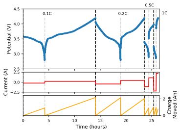
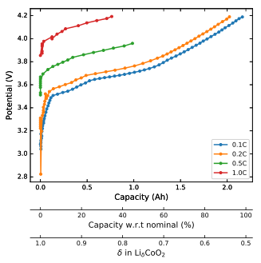

time: 0
class: title, no-number
# Lecture 4 - Batteries

.footer[- [Return to course contents](overview.html#overview)
]

---

class: roomy
# Lecture summary
$\require{mediawiki-texvc}$

- Electrochemistry fundamentals
- Battery history and overview
- Battery definitions
- Improving capacity
- Essential materials properties
	- types of electrode behaviour
- average vs local structure effects

---

class:compact
# Essential electrochemistry

## Quantities

Throughout this course, we will see a number of electronics/electrochemistry terms, summarised here:

.center[
Term | Symbol | Description | Units
:-----|:-|:-|:-
Potential (or voltage) | $E$ or $V$ | the 'push' moving the electrons | Volts (V)
Current | $I$ | the rate at which electrons move | Amperes (A)
Charge | $Q$ | amount of electrons | Coloumbs (C) or  Amp-hours (Ah, 1 mAh = 3.6 C)
Resistance | $R$ | effects reducing the current | Ohms ($\Omega$)
Capacitance | $C$ | ability to store charge | Farads (F)
Power | $P$ | how much current, and with what force | Watts (W)
]

---

class: compact
## Important relationships

Ohm's law - current and potential are linked:
$$ V = IR $$ (Ohm's law)
A current flowing for a period of time gives an overall charge:
$$Q = It$$
Power is a combination of current and voltage:
$$ P = IV $$
Resistivity $(\rho)$ and conductivity $(\sigma)$ are inversely related. Note that resistance $(R)$ is related to resistivity $(\rho)$ by accounting for the geometry of the object.
$$\rho = \frac{1}{\sigma}$$

???

$Q = It$ helps to understand why charge can have units of (m)Ah (particularly common in the battery literature)

---

class: compact
# Why batteries?

- Portable electronics
- Electric vehicles
- Grid-storage (e.g. from renewables)
- ...

Future batteries require more charge stored in a smaller volume and/or mass.

This requires *new materials* from chemistry.

---

# (Brief) Battery History 

- ***ca.* 190 AD**: Baghdad (or Parthian) battery
--

- **1800**: Volta created the voltaic pile
	- Alternating Ag and Zn discs, NaCl electrolyte
	- Enabled *chemistry* e.g. $\ce{2H2O -> H2 + O2}$

--

- **1836**: Daniell cell:  
$\ce{Zn|Zn^{2+}, SO4^{2-} || SO4^{2-} | Cu^{2+} | Cu}$
	- First practical electricity source (used to power telegraphs)

- **1859** Lead-acid battery (first rechargeable)
--

- **1886** The first dry cell: $\ce{Zn | NH4Cl | MnO2 }$
	- $\ce{NH4Cl}$ immobilised with plaster of Paris $(\ce{CaSO4 . {$0.5$} H2O})$
- **1899** The first alkaline battery: $\ce{NiO(OH) | KOH | Cd}$
- **1991** Li-ion battery commercialised by Sony

???

Voltaic pile came about as a disagreement between Volta and Galvani; the latter
had discovered that frogs legs would move when forming a circuit from two different types of metal.
Galvani asserted this was 'animal electricity'

---

# Definitions

A battery consists of two electrodes (cathode and anode) and an electrolyte.

.pull-left.w60[
Defining the *anode* and *cathode* depends whether we are charging or discharging.

In this course, we will use **discharge** definitions:

- Cathode is the **positive** electrode (gets reduced)
- Anode is the  **negative** electrode (gets oxidised)
]

???

The chemistry of a battery occurs at the cathode and anode, i.e. this is where reduction and oxidation occur. The electrolyte is required to stop the electrodes reacting directly, whilst also allowing ions (charge carriers) to move between the electrodes.

---

class: compact
# Charge carriers

.pull-left[
### Cationic battery
Charge carried across electrolyte by cations
- $\ce{Li+, Na+}$ ...
- $\ce{Mg^{2+}, Ca^{2+}}$, ...
- Even $\ce{Zn^{2+}, Al^{3+}}$
]
.pull-right[
### Anionic battery
Anion charge carrier in electrolyte
- $\ce{OH-}$ (NiCd or NiMH)
- $\ce{F^{-}, Cl^-}$
- $\ce{HSO4-}$ (in Pb-acid)
]

???

Anionic batteries were historically important (e.g. $\ce{OH-}$ and $\ce{HSO4-}$) but have dropped out of favour
due to the focus on Li-ion batteries. $\ce{Na+}$ and $\ce{Mg^{2+}}$ batteries are currently in development, but 
some researchers are investigating alternative anions (e.g. $\ce{F-}$) to overcome some of the limitations.

---

# What makes a 'good' battery?

Perhaps the most important parameter in batteries is the total *energy capacity*, $\mathrm{E_{bat}}$
- Combination of cell voltage (*V*) and amount of charge (*Q*) stored in the material:
.red[$$
\mathrm{E_{bat}} = QV
$$]
.grey[*Q* is expressed in units of Ah, so *E*bat is in Wh (Watt-hours). 
A 3 Wh battery can supply 3 W  of power for 1 hour]

???

Energy capacity (Ebat) is often also known as 'nominal energy' or just 'energy'. It is simply the amount of useful energy stored in the battery.
The total energy capacity depends on the size of the cell; e.g. an AA battery has ~ 2000 mAh @ 1.5 V (= 3 Wh), while an AAA has ~1000 mAh @ 1.5 V (= 1.5 Wh).

It's difficult to appreciate how much energy 1 Wh (or 3.6 kJ) equates to. Some rough examples:

Item | Energy required to run for one hour (Wh)
-----|--------------------------
42 inch LED TV | 60
Amazon Echo | 3
Leaf Blower | 2,500
Kettle | 2,000
Electric Car charging | 7,000
Smoke detector | 0.5
Average UK household | 2,700,000

--

- *E*bat is dependent on the amount of battery material. More useful are:
	- Specific (gravimetric) energy (Wh g-1).
	- (Volumetric) energy density (Wh L-1).
	
???

Because capacity depends on the cell size (amount of electrode material) the volumetric/gravimetric measures are more useful when considering chemistry. 

---

# Improving batteries

Ideally, we want to maximise *both* volumetric and gravimetric energy densities
	
.center[

]

.footer[
- &copy; Barrie Lawson]

---

# Approaches to increase $\mathrm{E_{bat}}$

## 1. Increase *operating voltage*, $V$

Need large (+ve or -ve) electrode potentials:  
large electronegativity differences (e.g. $\ce{Li+, F-}$)

---

## 2. Increase *charge stored*, $Q$

The charge stored in a material can be calculated using Faraday's Law:
$$
Q_{\mathrm{theoretical}} = \frac{nF}{3.6 M_w}\qquad(\text{in mAh g}^{-1})
$$

???
where $n$ is the charge (moles of electrons) stored per formula unit, $F$ is Faraday's constant (96485.3 C mol-1), and $M_w$ is the formula mass (g mol-1).
The factor 3.6 converts F from A.s mol-1 into A.h mol-1

--

*e.g.* for the cathode $ \ce{LiCoO_2 -> Li^+ + e^- + CoO_2} $:
--

$$
n = 1,
F = 96485.3 \: \mathrm{As\:mol}^{-1}, M_w = 97.873\: \mathrm{g\: mol^{-1}} \\\\
\therefore Q = 274\: \mathrm{mAh\: g}^{-1}
$$

--

In reality, the charge stored is less than the theoretical value.

- In this case, CoO2 is unstable: $ \ce{2Co^{IV}O_2 -> Co^{III}_2O_3 + \frac{1}{2}O_2} $
	- We can only safely reach Li0.5CoO2, so the useful capacity is 137 mAh g-1 or less

???

NOTE: the total charge stored in a full cell is limited by the electrode with the smallest capacity (although this can
be overcome by using more/less of each material).

---

class: roomy
# **Quiz**:  Energy capacity

The following table shows the charging half reactions for three potential cathodes.

Which will give the highest gravimetric energy storage?

Reaction | Potential vs. Li/Li+ (V)
-------|--------------
$\ce{LiCoPO4 -> Li^+ + CoPO4 + e^-}$ | 4.7
$\ce{LiF + Ag^0 -> AgF + Li^{+} + e^{-}}$ | 4.1
$\ce{LiTiS2 -> Li^+ + TiS2 + e^{-}}$ | 2.0

---

exclude: true
# Quiz Answers

Cathode | FW (g mol-1 | Q (mAh g-1) | V (V) | E (Wh g-1)
-----------|----|-------------------|-------|---------------------
$\ce{LiCoPO4}$ | 160.85 | 166.6 | 4.7 | 0.783
$\ce{LiF + Ag^0}$ | 133.81 (25.94 + 107.87) | 200.3 | 4.1 | 0.821
$\ce{LiTiS2}$ | 118.94 | 225.3 | 2.0 | 0.451

---

# Vote

---

# Results

---

# "Design rules" for battery materials

- Electrodes need to store lots of charge
	- High proportion of carrier ion *and/or* highly charged ions
- Anode and cathode should have large potential difference
	- Large electronegativity difference helps (hence Li and F)
- Electrodes should (ideally) conduct ions and electrons
- Electrolyte should conduct ions, but not electrons

???

While electrodes should ideally be electronic conductors (to allow electrons to reach the reaction sites) in 
practice poor electron conduction can be overcome by additives (such as carbon particles)

--

Electrode materials are grouped into two categories:
- Conversion
	- .grey[Redox reactions result in a significant structural change]
- Intercalation
	- .grey[Ions are inserted into the structure, but the structure remains largely unchanged]

???

Note that the terms intercalation and conversion have been derived from Li-ion battery research, but the 
ideas transfer to other technologies.

---

class: compact
# Conversion electrodes

This category covers a wide range of chemistries. 
As a general equation:
$$
\ce{A\_{$a$}B\_{$b$} + ($b\times c$)C^{n} + ($nbc - am$)e- <=> aA^{m} + $b$BC\_{$c$}}
$$
--

## Examples:
Chloride-ion battery cathodes:
$$\ce{BiCl3 + 3Li+ + 3e- <=> Bi^{0} + 3LiCl} $$
Lithium-sulfur cathode (here, $a = 0)$:
$$\ce{S + 2Li+ + 2e- <=> Li2S  }$$
Metal hydride anode (used in NiMH):
$$ \ce{ OH- + MH <=> H2O + M^0 + e- } $$

???
The metal hydride example can be understood as $\ce{A = OH}$ and $\ce{B = H}$. Note that this is an anode during discharge, so the half-reaction is written as an oxidation.

---

# Conversion electrodes (2)

### Advantages
- Wide range of reactions possible
	- could avoid scarce/expensive elements by using e.g. Fe, Cu, O...
- Large theoretical capacities
	- More than one charge carrier per heavy metal (see $\ce{BiCl3}$ example)

--

### Disadvantages
- Often low conductivity (ionic and/or electronic)
- Substantial volume changes during cycling
- Side reactions/dissolution of intermediate species

.footer[
- [Wu & Yushin, Energy Environ. Sci., 2017, 435.](https://doi.org/10.1007/s10008-017-3580-9)
]

---

# Intercalation electrodes

Material acts like an electrochemical "sponge", reversibly incorporating carrier ions.

### Example: $\ce{CoO2 + Li+ + e- <=> LiCoO2} $

.pull-left[

]

.pull-right[
- Close-packed hcp .red[oxygen] array
- .blue[$\ce{Co}$] occupies alternate layers of octahedral holes
- .gold[$\ce{Li+}$] can insert between Co layers, reducing $\ce{Co^{IV} <=> Co^{III}}$
	- Layer spacing varies with $x$
	- High $\ce{Li+}$ conductivity due to 2D vacancy-hopping mechanism
]

---

class: compact
# Local vs Average structure

Different measurement techniques probe different length scales

.pull-left[
**Local picture (e.g. NMR)**

Single Li atoms are removed at random

]

.pull-right[
**Long-range picture (Crystallography)**

Li position shows a *fractional occupancy*

]

---

time: 43:55
class: compact
exclude: true
# Charging rates

A high $\mathrm{E_{bat}}$ is good, but we want to (dis)charge batteries quickly!
- Tradeoff between *Power* ($P=IV$) and $\mathrm{E_{bat}} (=ItV)$
- Seen on a Ragone plot:

.footer[
- [B.D. McCloskey, J. Phys. Chem. Lett., **2015**, 6, 3592.](https://doi.org/10.1021/acs.jpclett.5b01813)]

$\mathrm{E_{bat}}$ depends on the (dis)charge rate, so to compare different materials we use the $C\mathrm{-rate} = \frac{I}{Q}$
- e.g. for a 1000 mAh battery: $1C$ would sustain 1 A for 1 hour, $2C$ gives 2A for 30 mins, $\frac{C}{6}$ gives 0.167 A for 6 hours, etc.

---

exclude: true
# Electrochemical measurements

To avoid variations in rate, battery analysis uses *Galvanostatic* (constant current) electrochemistry
- measure the resulting potential.
- easier to separate chemistry effects from rate effects

---

exclude: true
# Electrochemical measurements (2)

*e.g.* for a 2.2 Ah battery:

.pull-left[]

.pull-right[]

.pull-left[  Capacity is often expressed in a number of formats]

???

$\mathrm{E_{bat}}$ depends on the (dis)charge rate, so to compare different materials we use the $C\mathrm{-rate} = \frac{I}{Q}$
- e.g. for a 1000 mAh battery: $1C$ would sustain 1 A for 1 hour, $2C$ gives 2A for 30 mins, $\frac{C}{6}$ gives 0.167 A for 6 hours, etc.

---

exclude: true
# Material insights from galvanostats

Solid Solution | Two-phase region 
---------------|------------------
 |  
Ions can be continously added/removed from the material without a structural transition | Two distinct compositions exist together, and the relative proportions change with $x$

???

To a first approximation, the voltage depends linearly on the curvature of free energy with x,
$$
V \propto -\frac{\partial G(x)}{\partial x}.
$$
In the case of phase mixtures, the free energy follows a linear combination of the two phase minima,
 so the potential is constant.

For more information, see http://cpb.iphy.ac.cn/article/2016/1806/cpb_25_1_018210.html#close

---

class: compact
# Lecture recap

- we define cathode and anode under discharge conditions!
- two main categories of battery (based on mobile ion):
	- cationic or anionic
- we want to maximise	
	- Charge stored $Q$ in materials, and
	- operating voltage $V$
- Two types of electrode operation:
	- Conversion
		- wide range of chemistry, but problems with volume change and side reactions
	- intercalation
		- limited number of suitable materials
- we can understand the mechanism using galvanostatic electrochemistry

---

# Feedback

.footer[- [Return to course contents](overview.html#overview)
]