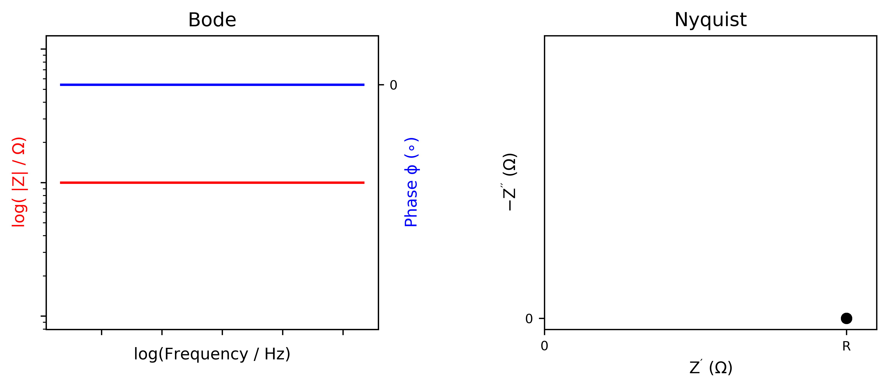
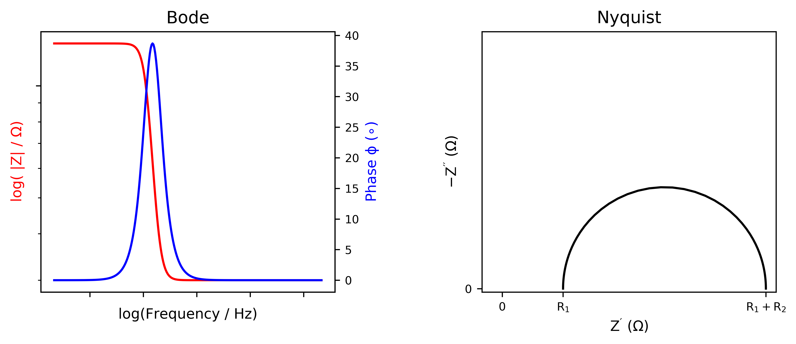
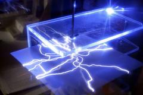
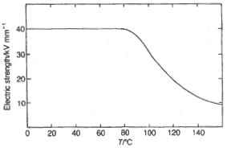

class: title, no-number
time: 0
# Lecture 5 - Dielectrics

.footer[- [Return to course contents](overview.html#overview)
]

---

time: 9
class: roomy
# Lecture Summary
$\require{mediawiki-texvc}$

- Origin of ionic polarisation
- Capacitor operation and definitions
- Impedance spectroscopy
	- definitions
	- ideal responses
- piezoelectricity
- ferroelectricity

---

time: 1:01
class: roomy
# Introduction

- Ionic conduction is a long-range effect
	- Important in batteries, fuel cells etc.
- In some situations, a highly insulating material is preferred
- Remember, ions are not static with time (e.g. phonons)
	- Short-range atomic motion is important for electrical properties

---

class: compact
time: 3:05
# Polarisation

Ionic solids are made up of cations and anions
- locally, this creates dipoles $(\mu)$
- across a whole crystal at equilibrium, these dipoles normally cancel

Under an applied electric field ($E$), ions displace from equilibrium

???

Note that we're assuming that ions are hard spheres, but in reality the ions will themselves be polarisable to different extents. 
The overall polarisation is a combination of this electronic polarisation and the ionic polarisation.

---

time: 5:25
# Is this useful?

If the dipoles do not cancel under an applied field, the crystal will develop an overall dipole moment
- can occur if e.g. number of cations $\neq$ number of anions

Can use this to screen electric fields
- Useful in e.g. wireless communication filters, sensor devices, transformers, and **capacitors**

---

time: 7:17
class: compact
# Capacitors

- Vital component of most electronic devices
	- Used to store charge, smooth signals, filter, etc...
	- $20bn per year industry

Essentially, a capacitor is an arrangement of two electrodes of area *A*, separated by a distance *d*.

The maximum charge stored, $Q = CV$ where $C$ is the capacitance (in Farads).

---

time: 9:32
class: compact
exclude: true
# Charge stored

With constant voltage $V$, current $(I)$ decays with time, while charge stored $(Q)$ increases:
$$
I_t = I_0 e^{\left(\frac{-t}{RC}\right)} \qquad\qquad Q_t = CV\left[1- e^{\left(\frac{-t}{RC}\right)}\right]
$$
where $C$ is the capacitance and $R$ is the resistance between voltage source and capacitor (e.g. in the wires)

.pull-right[
- As charge increases on the plates, it becomes harder to increase further.
- At infinite time, $Q = CV$.
]

---

time: 11:43
# Capacitance

Two electrodes separated by vacuum have a capacitance $C$;
$$
C = \frac{\epsilon_0 A}{d}
$$
where $\epsilon_0$ is the permittivity of free space = 8.854 &times; 10-12 C2 J-1 m-1

--

To increase $C$ (and therefore $Q$):
- decrease $d$ or increase $A$, **but**
- electrons will tunnel from one plate to the other if $d$ gets too small.

---

time: 13:41
class: compact
# Improving charge stored

Alternatively, we can use a **dielectric**
- opposing electric field stabilises charge on capacitor plates

$$
C_{\mathrm{dielec}} = \frac{\epsilon_r \epsilon_0 A}{d}
$$
where &epsilon;r is the relative permittivity of the dielectric (&epsilon;r= &epsilon; / &epsilon;0)
and &epsilon;r > &epsilon;0

---

time: 16:14
# Example permittivities

Material       |  Relative Permittivity, &epsilon;r
---------------|-----------------------------------------------:
Vacuum         | 1
Paper          | 2.0 - 6.0
Polymers       | 2.0 - 6.0
Silicon oil    | 2.7 - 2.8
Quartz         | 3.8 - 4.4
Glass          | 4 - 15
Al2O3 | 10
Ta2O5 | 26
TiO2 | 100
CaTiO3 | 130
SrTiO3 | 285
BaTiO3 | 1000 - 10000

---

time: 18:39
class: compact
# Characterising dielectrics

- Because dielectrics are insulating, conductivity measurements are not very useful
- Alternatively, oscillate between +ve and -ve potentials to change polarisation direction

--

**Impedance spectroscopy** applies an alternating (sinusoidal) field at different frequencies $f$, and measures the resulting current 
- Applied field, $E_t = E_0 \sin(\omega t)$, where $\omega = 2\pi f$
- Response current, $I_t = I_0 \sin(\omega t + \phi) $

---

time: 21:47
# Impedance

Similar to Ohm's law $(R=\frac{V}{I})$ for constant voltages, we can define *impedance* as the 'resistance' to an alternating voltage
$$Z(\omega) = \frac{E_t}{I_t}$$
--

The total impedance can be represented as a complex number: 
$$Z(\omega) = Z_0 e^{i \phi} = Z_0 (\cos \phi + i \sin \phi )$$

- $\phi$ is the 'phase-shift' between voltage and current.

.footer[
- Useful introduction to impedance [here](https://www.gamry.com/application-notes/EIS/basics-of-electrochemical-impedance-spectroscopy/)]

???

Note that impedance $Z$ depends on the frequency $\omega$.

The leap from $Z_0 e^{i \phi}$ to $Z_0 (\cos \phi + i \sin \phi )$ can feel mathematically overwhelming! It all stems from Euler's relationship
$$ \exp(i\phi) = \cos \phi + i \sin \phi$$
so a sinusoidal (or cosine) signal can be represented as a complex number. In this case, if we represent $E_t$ and $I_t$ as complex, then we can divide them:
$$
E_t = E_0 \exp(i \omega t) \quad\mathrm{and}\quad I_t = I_0 \exp(i [\omega t - \phi]) \\\\
Z(\omega) = \frac{E}{I} \\\\
\therefore \\\\
Z(\omega) = \frac{E_0}{I_0} \frac{\exp(i \omega t)}{\exp(i [\omega t - \phi])} = Z_0 \left( \exp([i \omega t] -  i [\omega t - \phi]) \right) = Z_0 \exp(i\phi)
$$

---

time: 23:38
class: compact
# Impedance analysis

$\phi$, $Z$ and $\omega$ (or $f$) are all important features of impedance.  
Two 'standard' ways to display data:

.pull-left[
**Bode plot**: $|Z|$ and $\phi$ plotted vs frequency

]
.pull-right[
**Nyquist plot**: $Z$ plotted in a 2D plane

]
--
.clear-right[In order to analyse these data, it is useful to fit an electrical circuit that gives the same behaviour]

???

Things to note:
- Bode plots normally have log axes
- Nyquist plots are usually plotted with a negative y-axis

---

time: 26:22
class: compact
# Ideal resistor response

Ideal resistor has no dependence on $\omega$
- Current is instantaneous on applying potential $E$
- e.g. ions moving with a constant "drag" due to interactions between them

---

time: 29:33
class: compact
# 'Ideal' capacitor response

- Current $I$ increases with $\omega$, approaching 0
- $I$ is always out-of-phase with $E$ by $\phi=90^{\circ}$
	- The maximum $I(t)$ occurs when $E(t) = 0$
- Represents stored charge building up, for instance ions accumulating on a surface

???

$Z''$ for a perfect capacitor can be related to $f$ by:

$$
Z'' = \frac{1}{\omega C} = \frac{1}{2 \pi f C}
$$

---

time: 33:16
class: compact
# 'Real' Impedance 

- Many materials behave like a parallel RC circuit:
	- Ions moving due to $E$, but motion is limited to a maximum displacement
	- Ionic conduction in a ceramic forming a charge gradient on the electrode surface

More complex behaviour is often observed, and can be modelled using *equivalent circuits*

---

time: 37:04
class: compact
# Real dielectric response 

Dielectrics are not ideal-they leak!
- Ions have mass, so cannot move instantly
- At high $\omega$, some resistance remains
	- energy lost as heat
- peak in $\phi$ vs $\omega$, corresponding to the maximum energy loss.
	- often reported as $\tan \delta$ (where $\delta = 90^{\circ} - \phi$)

---

time: 39:54
class: compact
exclude: true
# Other materials

In ionically conducting materials, an additional signal is often observed at low $\omega$
- Interactions between mobile ion and electrode(s)

--

Real materials usually consist of closely-packed ceramic grains. 
- different R/C effects for grain boundaries *vs.* bulk
- gives rise to two (often overlapping) semicircles.

---

exclude: true
# Dielectric breakdown

Dielectrics also break down under high electric fields
- Electrons start to conduct, causing localised heating and breakdown
- This is quantified as the **Dielectric Strength** (in *e.g.* V m-1)

.pull-left[  ]
.pull-right[ ]

---

# Question

---

# Results

---

time: 42:48
class: compact
# Piezoelectricity

In some dielectric materials, applying $E$ can result in a mechanical stress (or *vice versa*)
- Stress = change in lattice parameters

.pull-left[
**Direct effect**  
Applications:
- pressure sensors
- ultrasonic imaging
]
.pull-right[
**Converse effect**  
Applications:
- Actuators/motors
- crystal oscillator (watches)
]

---

time: 45:16
class: compact
# Structural Aspects

Stresses arise due to unbalanced dipoles
- Can only occur if the structure is **non-centrosymmetric**

### Example: Quartz $(\ce{SiO2})$

---

time: 47:27
class: compact
# Spontaneous polarisation

Some materials exhibit a net dipole *without* an applied electric field (**pyroelectric**)

If the polarisation can be switched with an electric field - **Ferroelectric**

---

time: 48:33
class: compact
# Structural origin

Precise origin of ferroelectricity is unknown!  
Often, displacement of small ion in a large 'cavity' is partly reponsible
- Driven by anharmonicity or pseudo-Jahn-Teller effects
- *sometimes* this results in long-range order of dipoles...
- Many perovskites are ferroelectric (e.g. $\ce{BaTiO3}$)

???

Pseudo-JT effects can occur when low-lying excited electronic states are degenerate (even though the ground state is not). If interactions between ground
and excited-states are strong enough, this can result in an overall distortion.

An alternative (and complementary) description is due to hybridisation of O-2p orbitals with empty Ti-3d orbitals ($\ce{Ti^{4+}}$ is $d^0$).

---

time: 51:17
# Applications

- Ferroelectrics often have the largest $\epsilon_r$
	- important for high-$C$ capacitors
- Could be coupled with e.g. ferromagnetism
	- **Multiferroics** are currently popular for electrical control of magnetic fields (e.g. in hard drives)

.footer[
- [Nice summary of ferroelectric mechanisms and multiferroics]( https://doi.org/10.1103/Physics.2.20)
]

---

time: 52:28
# Hierarchy of dielectrics

---

time: 53:17
class: compact
# Lecture recap

- Polarisation arises from cation-anion dipoles
	- Can be modified by external electric field
- Important in capacitors
	- charge stored increased by high $\epsilon_r$ dielectric
- Impedance spectroscopy can characterise ionic motion
	- Oscillating potential generates oscillating current
	- Impedance $Z(\omega)$ has both phase $(\phi)$ and magnitude $(|Z|)$
	- Many materials behave like parallel RC circuits
- Piezoelectricity is the linear relationship between polarisation and mechanical stress
	- requires non-centrosymmetric structures
- Pyro- and ferro-electrics exhibit spontaneous polarisation without applied electric fields
	- used where high permittivity is needed (e.g. capacitors)
	- current interest in multiferroics

---

# Feedback

.footer[- [Return to course contents](overview.html#overview)
]

