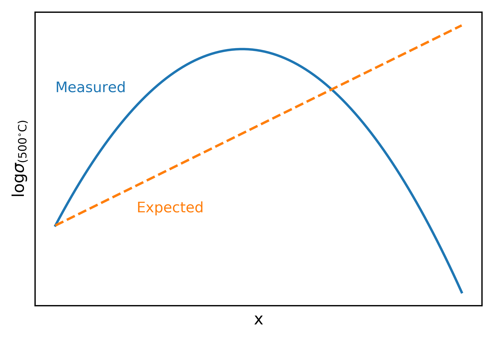
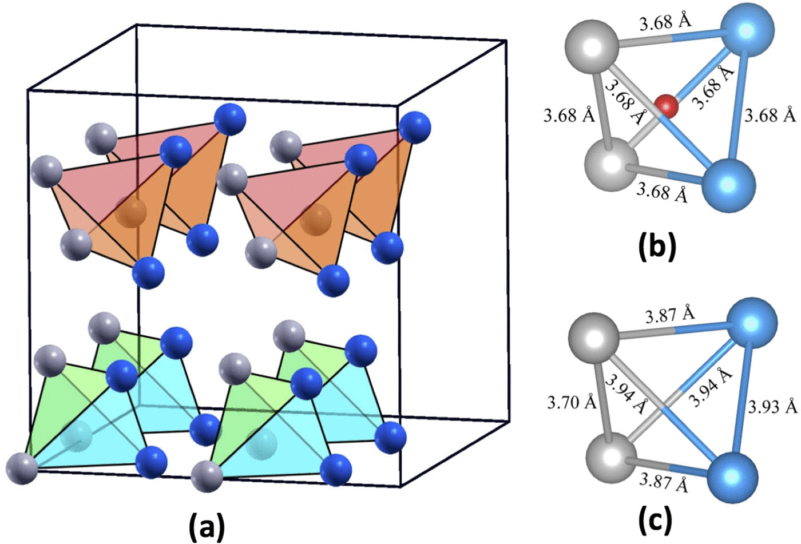

class: title, no-number

# Lecture 6 - Fuel cells

.footer[- [Return to course contents](overview.html#overview)
]

---

class: roomy
# Lecture Summary
$\require{mediawiki-texvc}$

- Fuel cell introduction
- Types of fuel cells
	- Polymer cells
	- Solid oxide fuel cells (SOFCs)
- Materials requirements for SOFCs
	- example materials
- Defect ordering

---

class: compact
# Fuel Cells

Fuel cells are similar to batteries; they have a cathode, electrolyte and anode.

Electricity can be generated as long as fuel is supplied (they don't need to be recharged)

---

class: compact

---

# Fuel cell fundamentals

$$
\ce{ {Fuel} + O2 -> H2O + nCO2}
$$

- Fuel cells grouped into *low-temperature* (LT, < 200 &deg;C) and *high-temperature* (HT, > 450 &deg;C). 

- H2 is the preferred fuel 
	- Particularly for LT devices.
	- Doesn't produce CO2
--

- Other fuels (*e.g.* CH3OH, CH4, NH3) also possible
	- Steam reforming reaction converts fuels to $\ce{H2}$:
	$$\ce{CH4 + H2O ->[>700 ^{\circ}C] CO + 3H2}$$
		- can be achieved in-situ for HT cells, but must be separate for LT.
	
	
---

class: compact
# Fuel cell efficiency

Fuel cells are *very* efficient
- Convert fuel &rarr; electricity directly, rather than   
fuel &rarr; heat &rarr; electricity (as in combustion)

$$
\text{Thermodynamic efficiency} = \frac{\Delta G}{\Delta H}
$$

*e.g.* for $ \ce{2H2 + O2 -> 2H2O} \ (\Delta H = -571.6\ \text{kJ mol}^{-1})$:

$$
\begin{align}
\text{Cathode:} & & \ce{4H+ + O2 + 4e- &-> 2H2O & & E} = +1.229 \mathrm{\ V} \\\\
\text{Anode:} & & \ce{4H+ + 4e- &<- 2H2} & & E = 0.00 \mathrm{\ V} \\\\
\end{align}
$$
--
$$
\begin{align}
\Delta G &= -nFE \\\\
         &= -4 \times F \times 1.229 \\\\
		 &= -474.3 \mathrm{\ kJ\ mol^{-1}} \qquad (\mathrm{per\ mole\ O_2})
\end{align}
$$
--
Efficiency = &eta; = -474.3 / 571.6 = **83%**

---

class: compact
# Efficiency with temperature

$$
\Delta G = \Delta H - T\Delta S, \quad
\therefore \quad
\frac{\Delta G}{\Delta H} = \eta = 1 - \frac{T \Delta S}{\Delta H}
$$

--

For 'ideal' combustion engine (heat engine) the maximum efficiency is the Carnot limit:
- $ \eta = \frac{T\_{\mathrm{hot}} - T\_{\mathrm{cold}}}{T\_{\mathrm{hot}}} $

--

???

A heat engine is one that converts heat into work, for instance by repeatedly heating and cooling a substance while extracting (usually 
mechanical) motion. The term covers a huge range of technologies including combustion engines, thermal power stations and fridges (a heat pump, 
which is a heat engine operating in reverse).

A really nice example (in which the heating/cooling is done on a sealed chamber of air) is the Stirling engine:

<iframe width="560" height="315" src="https://www.youtube.com/embed/taDHMw38aE0" frameborder="0" allow="accelerometer; autoplay; encrypted-media; gyroscope; picture-in-picture" allowfullscreen></iframe>

---

class: compact
# Types of fuel cell

Type | Mobile ion | Temperature (&deg;C) | Applications
-----|------------|--------------------------------|--------------
Alkaline | OH- | 50-100 | Stationary power, space missions
**Polymer**  | H+ or OH- | 50-100 | Portable devices, transport
Phosphoric acid (PAFC) | H+ | 220 | Medium to large scale combined heat and power (CHP) systems
Molten Carbonate (MCFC) | CO32- | 650 | &vellip;
**Solid Oxide (SOFC)** | O2- | 500 - 1000 | &vellip;

.footer[ - [L. Carrette, *Fuel Cells*, 2001, 5.](https://doi.org/10.1002/1615-6854(200105%291:1%3C5::AID-FUCE5%3E3.0.CO;2-G)
]

---

class: no-number
# Main low temperature device:  Proton exchange membrane fuel cell (PEMFC)

- Carbon electrodes with precious metal catalysts (Pt, Pd, Ru)
- Requires acidic proton-conducting polymer
	- *e.g.* Nafion
- Use H2 as fuel, but can work with MeOH (less efficiently)

.footer[
- Nafion
- Gemini spacecraft
]

???

Sometimes also known as polymer electrolyte membrane fuel cell

---

class: compact
# PEMFC + H2

$$
\begin{align}
\text{Anode:} & & \ce{2H+ + 2e- &<- H2} & & E = 0\ \mathrm{V}\\\\
\text{Cathode:} & & \ce{O2 + 2H+ + 2e- &-> H2O2} & & E = 0.695\ \mathrm{V} \\\\
& & \ce{H2O2 + 2H+ + 2e- &-> 2H2O} & & E = 1.776\ \mathrm{V}\\\\
\text{Cathode (Overall):} & & \ce{O2 + 4H+ + 4e- &-> 2H2O} & & E = 1.229\ \mathrm{V} \\\\
\end{align}
$$
--

- Good Low-temperature (< 100 &deg;C) operation .green[&#10004;]
	- Quick to start/stop
	- Suitable for portable applications
- H2O2 forms when acidic .red[&#10008;]
	- Corrodes carbon-containing electrodes 
	- Lowers cell voltage
	- Requires expensive Pt or Pd catalysts to decompose H2O2
- Need careful hydration to ensure H+ conduction  .red[&#10008;]

---

exclude: true
class: compact
# PEMFC + Methanol

Methanol easier to store/transport than H2
- Readily oxidised, does not require C-C bond breaking

$$
\begin{align}
\text{An.:} & & \ce{CO2 + 6H+ + 6e- &<- CH3OH + H2O} & & E = 0.046 \mathrm{\ V} \\\\
\text{Cat.:} & & \ce{\frac{3}{2}O2 + 6H+ + 6e- &-> 3H2O} & & E = 1.229 \mathrm{\ V} \\\\
\text{Overall:} & & \ce{ CH3OH + \frac{3}{2}O2 &-> CO2 + 2H2O} & & E= 1.183\mathrm{\ V}
\end{align}
$$

### Problems
- MeOH crosses from anode to cathode  .red[&#10008;]
	- Reduces cell voltage to ~0.5 V
- CO formed in side-reaction, blocking reaction sites  .red[&#10008;]
	- requires more Pt catalyst!

---

exclude: true
# Alkaline polymers?

- OH- as mobile ion prevents H2O2 formation .green[&#10004;]
- pH change alters redox energies, allowing Ni catalysts to replace Pt .green[&#10004;]
- Attaching counter-cation to the polymer reduces electrode poisoning .green[&#10004;]

- Current OH- polymers have low ionic conductivity! .red[&#10008;]

.footer[- [Y-J. Wang et al., *Chem. Soc. Rev.* **2013**, 42, 5768-5787.](https://doi.org/10.1039/C3CS60053J)
]

---

class: compact
# Main high temperature chemistry: Solid Oxide (SOFC)

- All-solid-state system (*i.e.* solid electrolyte)
- Most work at 800 - 1000 &deg;C

--
- Based around redox and conduction of O2-:

$$
\begin{align}
&\text{Anode:} & &\begin{cases}
\ce{2H2O + 4e- &<- 2H2 + 2O^{2-}} \\\\
\ce{2CO2 + 4e- &<- 2CO + 2O^{2-}} \\\\
\ce{H2O + \frac{1}{2}CO2 + 4e- &<- \frac{1}{2}CH4 + 2O^{2-}} \\\\
\end{cases}  \\\\
&\text{Cathode:} & &\quad\ce{O2 + 4e- -> 2O^{2-}} \\\\
\end{align}
$$

--
- High temperature allows internal steam reforming; many fuels
- No precious metal catalysts
- Excess heat can be used to increase efficiency (to ~90%)
	- drive an electricity turbine or combined heat and power (CHP)

---

class: compact
# SOFC Limitations

High temperatures:
- prevent rapid start/stop
- cause reactivity between electrolyte and electrodes
- make thermal expansion important

--

Delicate balance between:
- optimum temperature for redox and/or ionic conductivity
- thermal expansion, reactivity and device construction
- Intermediate-temperature (IT) SOFCs are the current optimum.

---

# Requirements for SOFC materials

Property | Anode              |       Electrolyte         |   Cathode
-------|-------------------|---------------------------|--------------
Electronic conductivity | High | Low | High
Ionic Conductivity | High | High | High
Chemical stability | reducing conditions | oxidising **and** reducing conditions | oxidising conditions
Catalytic activity | Fuel oxidation | $\ce{O2}$ reduction | $\ce{O2}$ reduction

Also: chemical compatibility between materials, similar thermal expansion, low cost, ...

---

class: compact
# 'Perfect' electrodes

Ideally, electrodes should be good electronic *and* ionic conductors!
- fuel/oxygen reactions would occur at the electrode surface

 

--

In reality, use a mixture of good ionic and electronic conductors.
- reactions occur at the **triple phase boundary**

 

---

# Typical anode materials

Usually a cermet (*i.e.* mixture) of Ni and electrolyte
- Ni &rarr; high e- conductivity and catalytic activity
	- but susceptible to poisoning by S (forming stable $\ce{NiS}$)
- High ionic conductivity from electrolyte

---

class: compact
# Typical cathode materials

Composite of $\ce{La\_{1-x}Sr\_{x}MnO\_{3}}$ perovskite (LSMO) and electrolyte
- LSMO gives e- conduction and high catalytic activity
	- $\ce{Sr^{2+}}$ subtitution generates holes in valence band
- poor performance below 700 &deg;C .red[&#10008;]

--

.pull-right[

]

Interest in mixed-conductors:
- $\ce{La\_{1-x}Sr\_{x}CoO\_{3-y}}$   (perovskite with $\ce{V_{O}}$)
	- good ionic/electronic conduction
	- high thermal expansion
- $\ce{La2NiO\_{4+x}}$
	- 'layered' $\ce{O\_{i}}$ conductor
	- $\ce{2Ni\_{Ni} + \frac{1}{2}O2 <=> O\_{i}^{''} + 2Ni\_{Ni}^{\bullet}}$

---

class: compact
# Electrolyte materials

Most studied electrolyte is $\ce{Y\_{0.15}Zr\_{0.85}O\_{1.925} }$ (yttrium-stabilised zirconia, YSZ)
- defective fluorite structure
- $\ce{Y2O3 + 2Zr\_{Zr} + O\_{O} <=> 2 Y\_{Zr}^{'} + V\_{O}^{\bullet\bullet} }$
- Sc-doping also effective (but expensive)

.pull-right[

]

Another commercial material is $\mathrm{Gd\_{0.1}Ce\_{0.9}O\_{1.95}}$ (CGO)
- Better for lower temperature
	- e- conductor above 600 &deg;C
	
Many other materials, but issues with cost, stability, manufacturing...

---

class: compact, no-number
# Improving Ionic conduction

As $\sigma = nq\mu$, so  as [defects] &uarr;, $\sigma$ &uarr;

--

*However*, at high defect concentrations we can get **defect clusters**
- Local ordering of defects reduces mobility

--

*e.g.* in YSZ:
$(\ce{(1-x)ZrO2 + \frac{x}{2}Y2O3 -> Y\_{x}Zr\_{1-x}O\_{2-\frac{x}{2}} })$

.pull-left[]
.pull-right[  ]

.footer[
- Conductivity vs $x$ in YSZ
- Ideal arrangement for $x=0.5, \ce{Y2Zr2O7}$
] 

???

In YSZ, introducing two Yttrium atoms (x=2) results in the formation of one oxygen vacancy.
Locally, these are found to order; the optimum arrangement is for each OM4 tetrahedron
to contain 2 Zr and 2 Y, with oxygen vacancies arranging in a 'grid-like'p pattern.

The figure (a) shows the the equilibrium arrangement for Y2Zr2O7 (x = 0.5). 
Compare this with the ideal fluorite structure consisting of edge-sharing OM4 tetrahedra, shown below:

---

class: compact
# Long-range defect ordering

As discussed in Lecture 2, defects can undergo long-range order
- Temperature can induce order-disorder phase transition

### Example: Ba2In2O5
- Brownmillerite structure ($\ce{ABO\_{2.5}}$ perovskite with ordered $\ce{V\_{O}^{\bullet\bullet}}$)
- Large increase in $\sigma$ at phase transition

.pull-left[ 
]

---

class: compact
# Lecture recap

- fuel cells operate like a battery with continous 'charge' supply
	- Many similar materials properties required
- different technologies work at different temperatures
	- advantages and disadvantages for both
- properties of electrolyte, cathode and anode must be optimised
- ideal electrodes would be ionically *and* electronically conducting
	- more commonly a mixture of materials is used
- Ionic conduction reaches a maximum with defect concentration
	- defect ordering occurs
- Defect ordering can give rise to new structure types

---

# Feedback

.footer[- [Return to course contents](overview.html#overview)
]

